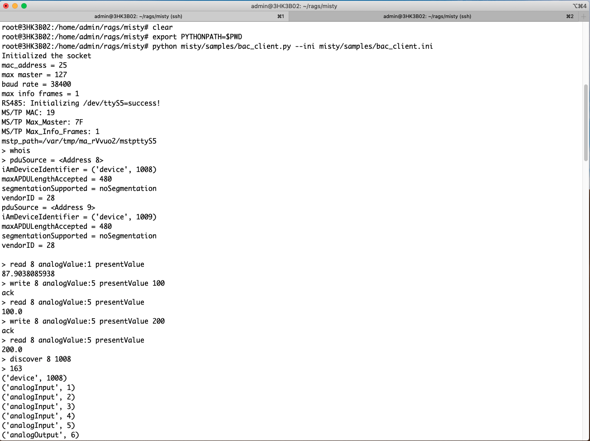
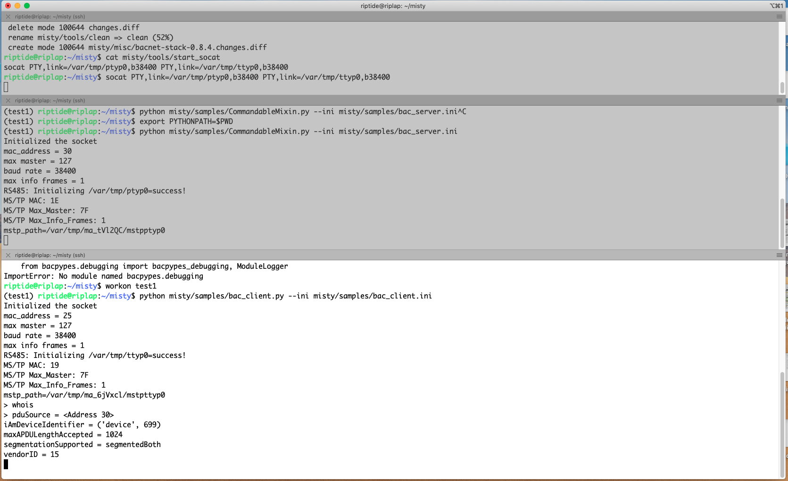

#  misty

The misty project helps build [bacpypes](https://github.com/JoelBender/bacpypes)   applications that work on MS/TP Networks. The existing bacpypes BIP (BACnet IP ) applications can be easily ported to to use misty and work on MS/TP Networks.

# Table of Contents

- [misty](#misty)
- [Table of Contents](#table-of-contents)
- [How does this Work ?](#how-does-this-work--)
- [Installation and Usage for Users](#installation-and-usage-for-users)
- [Installation and Usage for Developers](#installation-and-usage-for-developers)
- [Testing MSTP  Applications](#testing-mstp--applications)
- [Porting bacpypes IP Apps to MSTP](#porting-bacpypes-ip-apps-to-mstp)
- [Limitations](#limitations)
- [Snap build, installation and Usage](#snap-build--installation-and-usage)

# How does this Work ?

For supporting bacpypes applications on MSTP Network, a new class for application called **MSTPSimpleApplication** has been created.  All the MSTP applications need to derive from the MSTPSimpleApplication.

A bacpypes application derived from MSTPSimpleApplication sends and receives data to an MSTP Agent. The MSTP Agent receives the packets sent out by the bacpypes application and sends it out on the Serial port using the Serial port Driver. In the response path, the Serial port Driver receives the MSTP Frame sent by the peer and passes it to the MSTP Agent. The MSTP agent hands it over to the bacpypes application.Each bacpypes application derived from MSTPSimpleApplication is tied to a Physical Interface (e.g. ttyS0).

The MSTP Agent relies on the open source [bacnet-stack version 0.8.4](https://sourceforge.net/projects/bacnet/files/bacnet-stack/) by skarg for communicating with the Serial port. The MSTP Agent uses the dlmstp_xxx functions of the bacnet-stack to send/receive the MSTP Frames and also to set configuration parameters of the Serial port (like baud rate, max_info).

The following image shows the idea on which the misty is based.


# Installation and Usage for Users

This section talks about the installation for people who are interested in using misty as a product to interact with the BACnet devices connected on a serial port to the Linux machine. 

(1) Install the misty package in your python environment
```
$ pip install misty
```
(2) copy the ini file required for running the BACnet client by running the cp_ini command. This copies a template of ini file required for a BACnet client at the specified file location
```
$ cp_ini -t client ./bc.ini
```
(3) Edit the **bc.ini** file to specify the interface, max_masters, baudrate, maxinfo.  A sample bc.ini is shown below.
```ini
[BACpypes]
objectName: BACClient
address: 25
interface:/dev/ttyS5
max_masters: 127
baudrate: 38400
maxinfo:1
objectIdentifier: 599
maxApduLengthAccepted: 1024
segmentationSupported: segmentedBoth
vendorIdentifier: 15
foreignPort: 0
foreignBBMD: 128.253.109.254
foreignTTL: 30
```
(4) Run the BACnet client (bc) program. Execute 'whois' and other commands found by using help
```
$ sudo bc --ini ./bc.ini
Initialized the socket
mac_address = 25
max master = 127
baud rate = 38400
max info frames = 1
RS485: Initializing /dev/ttyS5=success!
MS/TP MAC: 19
MS/TP Max_Master: 7F
MS/TP Max_Info_Frames: 1
mstp_path=/var/tmp/ma_CrAvEt/mstpttyS5

> whois
pduSource = <Address 8>
iAmDeviceIdentifier = ('device', 1008)
maxAPDULengthAccepted = 480
segmentationSupported = noSegmentation
vendorID = 28
pduSource = <Address 9>
iAmDeviceIdentifier = ('device', 1009)
maxAPDULengthAccepted = 480
segmentationSupported = noSegmentation
vendorID = 28

> help

Documented commands (type help <topic>):
========================================
EOF      bugin   discover  gc    iam      mstpstat  rtn    whois
buggers  bugout  exit      help  mstpdbg  read      shell  write
```

# Installation and Usage for Developers

This section talks about the installation for people who are interested in learning about misty and experiment with changes. This requires knowledge of Python Programming language and familiarity with Linux operating system as a user.  

(1) Install the bacpypes package in your python environment
```
$ pip install bacpypes==0.18.0
```
(2) Clone the MSTP Agent repository with the following command:
```
$ git clone https://github.com/riptideio/misty.git
```
(3) Make the MSTP Agent library using the following commands. This requires the C compiler and make utilities to be installed.
```
$ cd misty/mstplib
$ make clean_build
```
(4) Edit the **bac_client.ini** file in the **misty/samples** directory to set the following values as appropriate to your setup.

*  MS/TP address
*  interface
*  baudrate
*  max masters
* max info

A sample bac_client.ini file is shown below
```ini
[BACpypes]
objectName: BACClient
; MSTP Local address
address: 25
; The serial port device
interface:/dev/ttyS0
; other mstp config parameters max_masters, baudrate, maxinfo
max_masters: 127
baudrate: 38400
maxinfo:1
objectIdentifier: 599
maxApduLengthAccepted: 1024
segmentationSupported: segmentedBoth
vendorIdentifier: 15
foreignPort: 0
foreignBBMD: 128.253.109.254
foreignTTL: 30
```
(5) Start the bacnet client program present in the **misty/samples** directory
```
$ export PYTHONPATH=$PWD
$ python misty/samples/bac_client.py --ini misty/samples/bac_client.ini
```
The bacnet client program console offers commands to do basic BACnet commands like

*  whois
*  iam
*  read
*  write
* discover
* mstpstat
* mstpdbg

A sample interaction using the bac_client.py with KMC AppStat devices is shown  below




# Testing MSTP  Applications

The **socat** utility is useful  to test the MSTP applications without having  Hardware devices.

The following is the procedure for using *socat* to test the interaction of BACnet server and BACnet client.


(1) Execute the socat utility to create two connected virtual serial ports ptyp0 and ttyp0 in a terminal window
```
$ socat PTY,link=/var/tmp/ptyp0,b38400 PTY,link=/var/tmp/ttyp0,b38400
```
(2) On a new terminal window , start the BACnet server on ptyp0. The configuration file bac_server.ini has the interface ptyp0 configured at 38400 baud rate.
```
$ export PYTHONPATH=$PWD
$ python misty/samples/ReadPropertyMultipleServer.py --ini misty/samples/bac_server.ini
```
(3) On a new terminal window, start the BACnet client on ttyp0. The configuration file bac_client.ini has the interface ptyp0 configured at 38400 baud rate.
```
$ export PYTHONPATH=$PWD
$ python misty/samples/bac_client.py --ini misty/samples/bac_client.ini
```
Now we can use any of the commands supported on the BACnet client console to send messages to BACnet Server. For example
*  whois
*  discover
*  read
*  write

The following image shows a sample interaction between the BACnet Server, and BACnet client program running on the same machine using socat utility




# Porting bacpypes IP Apps to MSTP

To port an bacpypes BIPSimpleApplication to use the MSTP Networks, the following changes are required in the configuration file and application.

(1) The ini file used for the configuration of the MSTPSimpleApplication would contain additional MSTP interface details.

*  address - MSTP Mac Address
*  interface - Physical Device (e.g. ttyS0)
*  max_masters
*  baudrate
*  maxinfo


A Sample **INI File** for MSTPSimpleApplication is shown below

```ini
[BACpypes]
objectName: BACClient
address: 25
interface:/dev/ttyS0
max_masters: 127
baudrate: 38400
maxinfo:1
objectIdentifier: 599
maxApduLengthAccepted: 1024
segmentationSupported: segmentedBoth
vendorIdentifier: 15
foreignPort: 0
foreignBBMD: 128.253.109.254
foreignTTL: 30
```

(2) The Application class needs to be derived from MSTPSimpleApplication instead of BIPSimpleApplication.
```python
class BacnetClientApplication(BIPSimpleApplication):
```
would be changed to

```python
from misty.mstplib import MSTPSimpleApplication
class BacnetClientApplication(MSTPSimpleApplication):
```
(3) The Local device object in the MSTPSimpleApplication should be initialised with the additional MSTP interface details. The following shows a typical local object initialisation for a MSTP Simple Application.

```python
 # make a device object
 mstp_args = {
     '_address': int(args.ini.address),
     '_interface':str(args.ini.interface),
     '_max_masters': int(args.ini.max_masters),
     '_baudrate': int(args.ini.baudrate),
     '_maxinfo': int(args.ini.maxinfo),
 }
 this_device = LocalDeviceObject(ini=args.ini, **mstp_args)
```

The misty/samples directory contains some bacpypes IP applications ported to use the MSTP Network
- CommandableMixin
- ReadProperty
- ReadPropertyMultiple
- ReadPropertyMultipleServer
- ReadWriteProperty
- WhoIsIAm

# Limitations
The following are the known limitations of MSTP Agent Project

*  Support for Linux only


# Snap build, installation and Usage

Snap build (requires Snapcraft to be installed)

(1) Run the build_snap script; this should create the misty snap (it would clean and recreate if snap already exists). In this case, the snap created is named misty_0.0.X_amd64.snap.
```
$ snap-builder:~/misty$ ./build_snap
```
(2) To install the Snap - execute the below command
```
$ snap install misty_0.0.4_amd64.snap --devmode
misty 0.0.4 installed
```
(3) The Misty snap exposes two commands: bc and props

*  Run the props command to setup the ini file that is required to run Misty. Executing the props command should open up an ini file in vi editor. Use sudo to edit the file.
*  Once the ini file has been setup, run the misty.bc command to execute bacnet client.
```
$ sudo misty.props
$ sudo misty.bc
Initialized the socket
mac_address = 25
max master = 127
baud rate = 38400
max info frames = 1
successfully able to open the device /dev/ttyS2
RS485: Initializing /dev/ttyS2=success!
MS/TP MAC: 19
MS/TP Max_Master: 7F
MS/TP Max_Info_Frames: 1
mstp_path=/var/tmp/ma_ADtI4I/mstpttyS2
```
(4) Sample commands to verify Misty.
```
> whois
pduSource = <Address 2>
iAmDeviceIdentifier = ('device', 1002)
maxAPDULengthAccepted = 480
segmentationSupported = noSegmentation
vendorID = 28
pduSource = <Address 3>
iAmDeviceIdentifier = ('device', 1003)
maxAPDULengthAccepted = 480
segmentationSupported = noSegmentation
vendorID = 28
> discover 3 1003
162
('device', 1003)
('analogInput', 1)
('analogInput', 2)
> read 3 analogValue:1 presentValue
74.9051208496
> write 3 analogValue:2 presentValue 50
ack
> read 3 analogValue:2 presentValue
50.0
```
