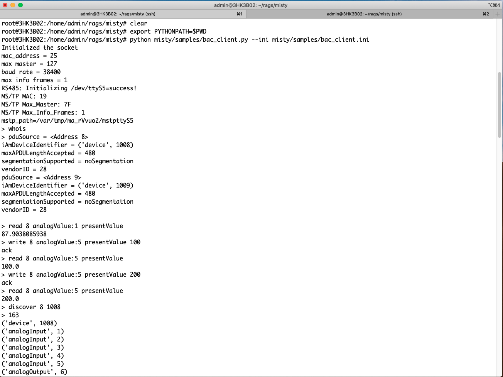
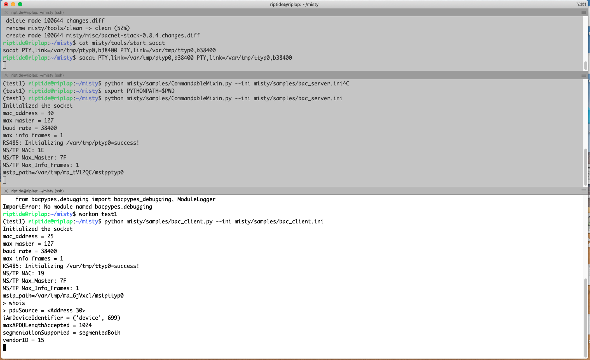

#  misty

The misty project helps build [bacpypes](https://github.com/JoelBender/bacpypes)   applications that work on MS/TP Networks. The existing bacpypes BIP (BACnet IP ) applications can be easily ported to to use misty and work on MS/TP Networks.

# Table of Contents

- [misty](#misty)
- [Table of Contents](#table-of-contents)
- [How does this Work ?](#how-does-this-work--)
- [Installation and Usage for Users](#installation-and-usage-for-users)
- [Installation and Usage for Developers](#installation-and-usage-for-developers)
- [Testing MSTP  Applications](#testing-mstp--applications)
- [Porting bacpypes IP Apps to MSTP](#porting-bacpypes-ip-apps-to-mstp)
- [Limitations](#limitations)
- [Snap build, installation and Usage](#snap-build--installation-and-usage)

# How does this Work ?

For supporting bacpypes applications on MSTP Network, a new class for application called **MSTPSimpleApplication** has been created.  All the MSTP applications need to derive from the MSTPSimpleApplication.

A bacpypes application derived from MSTPSimpleApplication sends and receives data to an MSTP Agent. The MSTP Agent receives the packets sent out by the bacpypes application and sends it out on the Serial port using the Serial port Driver. In the response path, the Serial port Driver receives the MSTP Frame sent by the peer and passes it to the MSTP Agent. The MSTP agent hands it over to the bacpypes application.Each bacpypes application derived from MSTPSimpleApplication is tied to a Physical Interface (e.g. ttyS0).

The MSTP Agent relies on the open source [bacnet-stack version 0.8.4](https://sourceforge.net/projects/bacnet/files/bacnet-stack/) by skarg for communicating with the Serial port. The MSTP Agent uses the dlmstp_xxx functions of the bacnet-stack to send/receive the MSTP Frames and also to set configuration parameters of the Serial port (like baud rate, max_info).

The following image shows the idea on which the misty is based.


# Installation and Usage 

This section talks about the installation for people who are interested in using misty as a product to interact with the BACnet devices connected on a serial port to the Linux machine.

## Prereqs (Linux / Raspberry Pi)

```bash
sudo apt-get update
sudo apt-get install -y build-essential   # gcc, make
# optional: serial access for /dev/tty*
sudo usermod -a -G dialout $USER && echo "re-login for group change to take effect"
```
## Create a virtualenv
```bash
python -m venv .venv
source .venv/bin/activate
python -m pip install --upgrade pip
```

## Clone and install misty
```bash
git clone https://github.com/riptideio/misty.git
cd misty
# builds the C library and installs in editable mode
python -m pip install . 
```
Force a clean, local rebuild if you see stale files

```bash
pip cache purge
rm -rf build dist *.egg-info src/build
python -m pip install --no-cache-dir --force-reinstall .
```
Verify Installation
```bash
# This should show misty
pip list
```
## Running BACnet client

Start the bacnet client program present in the **samples** directory
```
python samples/bac_client.py --ini samples/bac_client.ini
```
The bacnet client program console offers commands to do basic BACnet commands like

*  whois
*  iam
*  read
*  write
* discover
* mstpstat
* mstpdbg

A sample interaction using the bac_client.py with KMC AppStat devices is shown  below




The **socat** utility is useful  to test the MSTP applications without having  Hardware devices.

The following is the procedure for using *socat* to test the interaction of BACnet server and BACnet client.

(1) Execute the socat utility to create two connected virtual serial ports ptyp0 and ttyp0 in a terminal window
```bash
socat PTY,link=/var/tmp/ptyp0,b38400 PTY,link=/var/tmp/ttyp0,b38400
```
(2) On a new terminal window , start the BACnet server on ptyp0. The configuration file bac_server.ini has the interface ptyp0 configured at 38400 baud rate.
```bash
python samples/ReadPropertyMultipleServer.py --ini samples/bac_server.ini
```
(3) On a new terminal window, start the BACnet client on ttyp0. The configuration file bac_client.ini has the interface ptyp0 configured at 38400 baud rate.
```bash
python samples/bac_client.py --ini samples/bac_client.ini
```
Now we can use any of the commands supported on the BACnet client console to send messages to BACnet Server. For example
*  whois
*  discover
*  read
*  write

The following image shows a sample interaction between the BACnet Server, and BACnet client program running on the same machine using socat utility




# Porting bacpypes IP Apps to MSTP

To port an bacpypes BIPSimpleApplication to use the MSTP Networks, the following changes are required in the configuration file and application.

(1) The ini file used for the configuration of the MSTPSimpleApplication would contain additional MSTP interface details.

*  address - MSTP Mac Address
*  interface - Physical Device (e.g. ttyS0)
*  max_masters
*  baudrate
*  maxinfo


A Sample **INI File** for MSTPSimpleApplication is shown below

```ini
[BACpypes]
objectName: BACClient
address: 25
interface:/dev/ttyS0
max_masters: 127
baudrate: 38400
maxinfo:1
objectIdentifier: 599
maxApduLengthAccepted: 1024
segmentationSupported: segmentedBoth
vendorIdentifier: 15
foreignPort: 0
foreignBBMD: 128.253.109.254
foreignTTL: 30
```

(2) The Application class needs to be derived from MSTPSimpleApplication instead of BIPSimpleApplication.
```python
class BacnetClientApplication(BIPSimpleApplication):
```
would be changed to

```python
from misty.mstplib import MSTPSimpleApplication
class BacnetClientApplication(MSTPSimpleApplication):
```
(3) The Local device object in the MSTPSimpleApplication should be initialised with the additional MSTP interface details. The following shows a typical local object initialisation for a MSTP Simple Application.

```python
 # make a device object
 mstp_args = {
     '_address': int(args.ini.address),
     '_interface':str(args.ini.interface),
     '_max_masters': int(args.ini.max_masters),
     '_baudrate': int(args.ini.baudrate),
     '_maxinfo': int(args.ini.maxinfo),
 }
 this_device = LocalDeviceObject(ini=args.ini, **mstp_args)
```

The misty/samples directory contains some bacpypes IP applications ported to use the MSTP Network
- CommandableMixin
- ReadProperty
- ReadPropertyMultiple
- ReadPropertyMultipleServer
- ReadWriteProperty
- WhoIsIAm

# Limitations
The following are the known limitations of MSTP Agent Project

*  Support for Linux only

